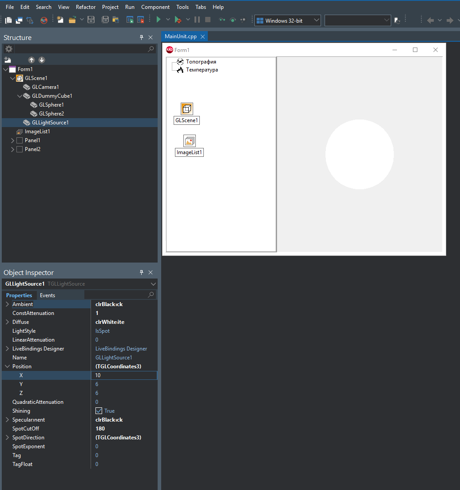

# 🌍 Основы ГИС: Лабораторные работы

Данный репозиторий содержит выполнение лабораторных работ по курсу проектирования и программирования основ геоинформационных систем (ГИС).
Проекты разработаны на **C++** в среде **RAD Studio (C++Builder)** с использованием 3D-движка **GLScene**.

---

## 📌 Лабораторная работа №1: Модель глобуса с географической сеткой координат

### 🎯 Цель работы

Разработать базовое ГИС-приложение для визуализации трехмерной модели Земли (глобуса), реализовать загрузку тематических глобальных карт (Топография, Температура) и наложить прозрачную географическую сетку координат.

### 🛠 Стек технологий и инструменты

- **Среда разработки:** Embarcadero RAD Studio C++Builder.
- **Графический движок:** GLScene (VCL).
- **Интерфейс:** Компоненты VCL (`TTreeView`, `TImageList`, `TPanel`).

### ⚙️ Архитектура и техническая реализация

1.  **3D-сцена и рендеринг:**
    - В качестве центра сцены используется объект `TGLDummyCube`, выполняющий роль оси вращения.
    - Модель Земли реализована на базе графического примитива `TGLSphere`, помещенного внутрь `TGLDummyCube`.
    - Управление камерой (`TGLCamera`) сфокусировано на центре куба (`TargetObject`).
2.  **Управление слоями (Тематические карты):**
    - Интерфейс выбора слоев реализован через дерево узлов `TTreeView` с привязанными иконками из `TImageList`.
    - При смене узла динамически обновляется материал сферы — загружаются соответствующие текстуры (`topography.jpg`, `temperature.jpg`) с локального диска.
3.  **Географическая сетка координат:**
    - Координатная сетка (`unigrid.bmp`) наложена поверх Земли с помощью дополнительной сферы (`GLSphere2`), радиус которой увеличен (`1.02`) во избежание Z-fighting (мерцания текстур).
    - Прозрачность фона сетки реализована через настройки материала: включен `BlendingMode = bmTransparency`, а режим `ImageAlpha` настроен на отсечение цвета углового пикселя (`tiaTopLeftPointColorTransparent`).
    - Для независимости сетки от освещения используется свойство `Emission.Color`.
4.  **Интерактивность:**
    - Реализовано свободное вращение глобуса мышью (Drag & Drop) через обработку событий `OnMouseDown` и `OnMouseMove` компонента `GLSceneViewer`. Математика вращения применяется к `TGLDummyCube` (методы `Turn` и `Pitch`).

### 🎮 Как использовать (Управление)

- **Зажатие Левой Кнопки Мыши (ЛКМ) по глобусу + движение** — вращение Земли по осям X и Y.
- **Меню слева** — переключение между режимами отображения "Топография" и "Температура".

### 📸 Скриншоты работы программы

