<div align="center">
  
  
</div>

<p align="center">
  <a href="#-навигация-по-работам"></a>
  
  
  
  
</p>

---

<table width="100%">
  <tr>
    <td width="50%">
      <b>🎓 Информация о студенте:</b><br>
      Фролов Артем Алексеевич<br>
      Группа: 12002531 (1 курс)<br>
    </td>
    <td width="50%">
      <b>👨‍🏫 Проверил:</b><br>
      доц. Васильев Павел Владимирович<br>
      Кафедра МПОИС<br>
    </td>
  </tr>
</table>

---

## 📑 Навигация по работам
| ЛР | Тема | Инструменты | Готовность |
| :---: | :--- | :--- | :---: |
| **1** |[Построение карт в изолиниях](#-лабораторная-работа-1) | `Surfer` |  |
| **2** | [3D объект с геопривязкой](#-лабораторная-работа-2) | `SketchUp`, `Google Earth` |  |
| **3** | [3D Глобус и триангуляция](#-лабораторная-работа-3) | `C++`, `GLScene` |  |
| **4** | [Android GPS Навигатор](#-лабораторная-работа-4) | `FireMonkey`, `GPS API` |  |
| **5** | [Локализация интерфейса](#-лабораторная-работа-5) | `i18n`, `Delphi` |  |

---

<a id="-лабораторная-работа-1"></a>
## 🗺 Лабораторная работа 1
### Построение карт в изолиниях в программе Surfer

> [!TIP]
> В этой работе мы использовали математический синтез ландшафта вместо обычного импорта точек.

#### Математическая модель рельефа:
Для генерации сетки (Grid) использовалась комплексная функция, имитирующая макрорельеф:
$$Z = 100 \cdot e^{-\frac{(X-50)^2+(Y-50)^2}{1000}} - 30 \cdot e^{-\frac{(X-Y)^2}{150}} + 15\sin\left(\frac{X}{6.5}\right)\cos\left(\frac{Y}{8.2}\right)$$

**Результат визуализации:**
<p align="center">
  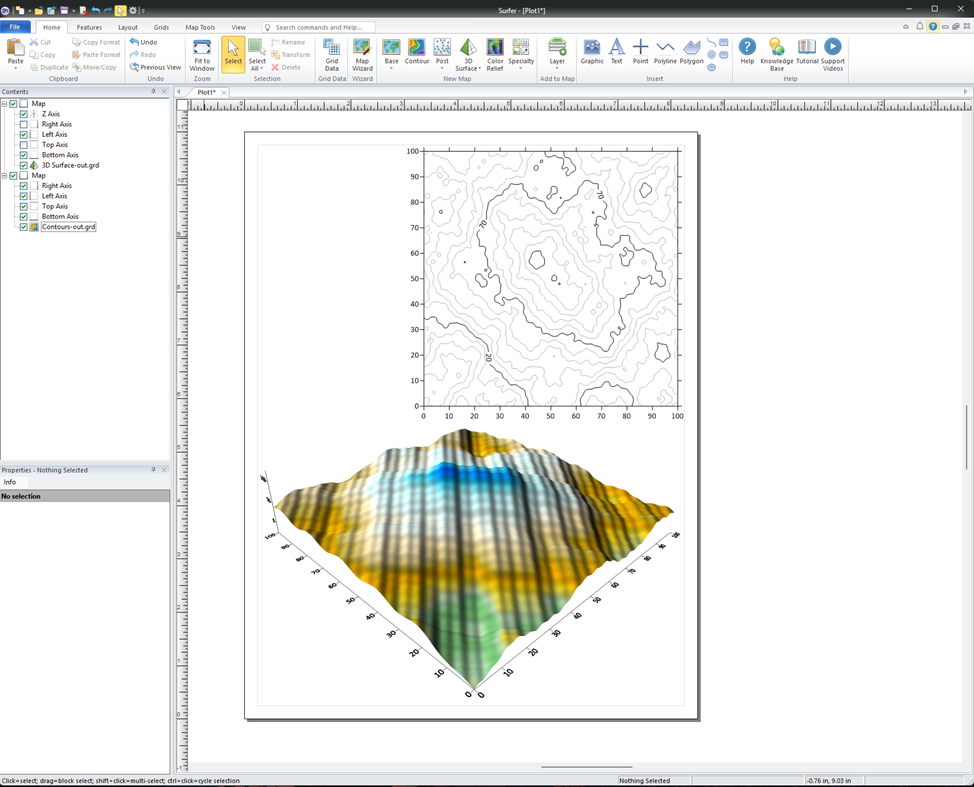
  <br><i>Рисунок 1 — 2D Изолинии (сверху) и 3D поверхность (снизу)</i>
</p>

<div align="right"><a href="#-навигация-по-работам">⬆ Наверх к меню</a></div>

---

<a id="-лабораторная-работа-2"></a>
## 🏢 Лабораторная работа 2
### Создание 3D объекта на карте с привязкой к геокоординатам

Здесь реализован классический ГИС-пайплайн: **SketchUp → Export KMZ → Google Earth Pro**.

#### Этапы разработки:
<table align="center" style="border-collapse: collapse; border: none;">
  <tr>
    <td align="center">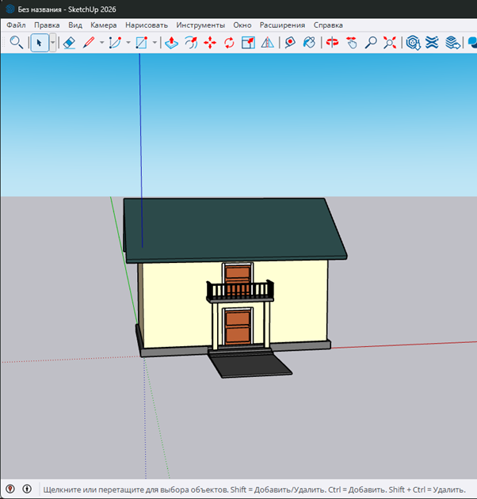<br><b>1. Моделирование геометрии</b></td>
    <td align="center">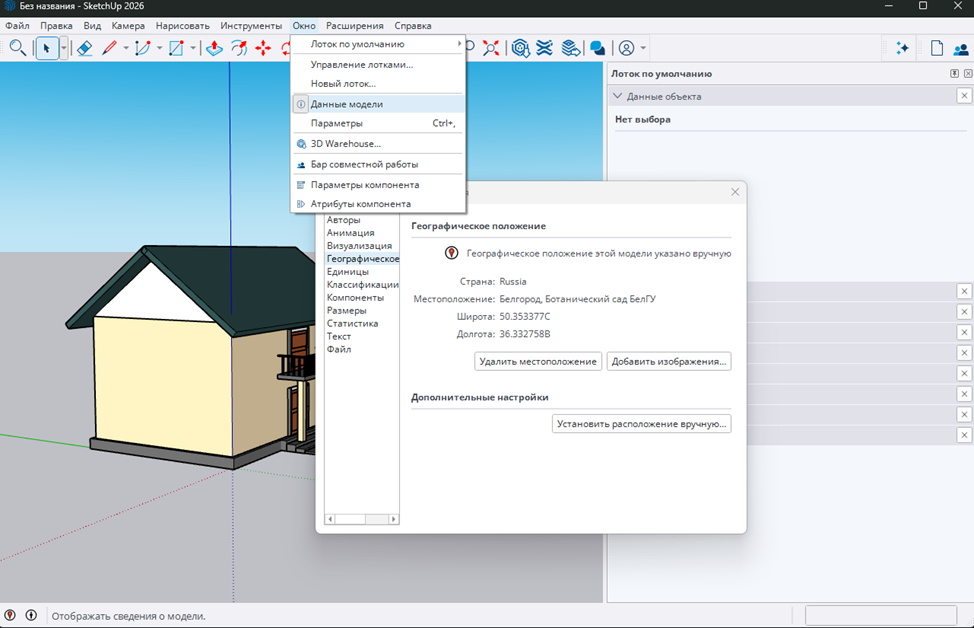<br><b>2. Привязка к координатам</b></td>
  </tr>
  <tr>
    <td align="center">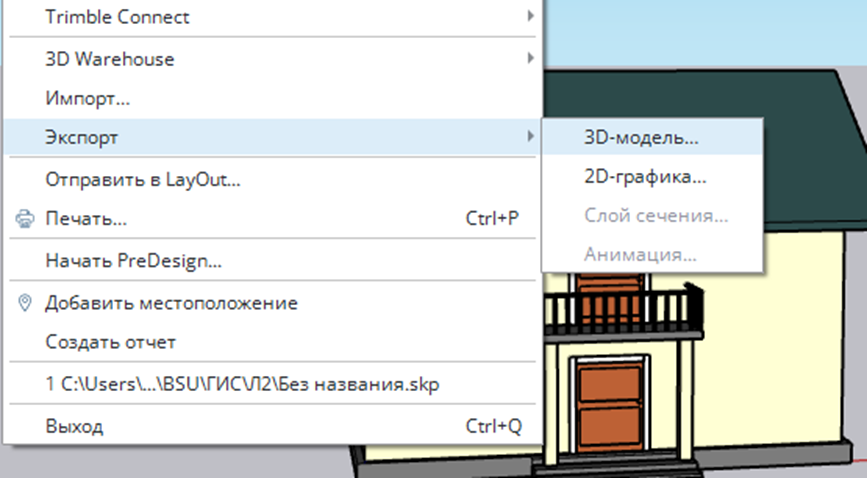<br><b>3. Сохранение в формате KMZ</b></td>
    <td align="center">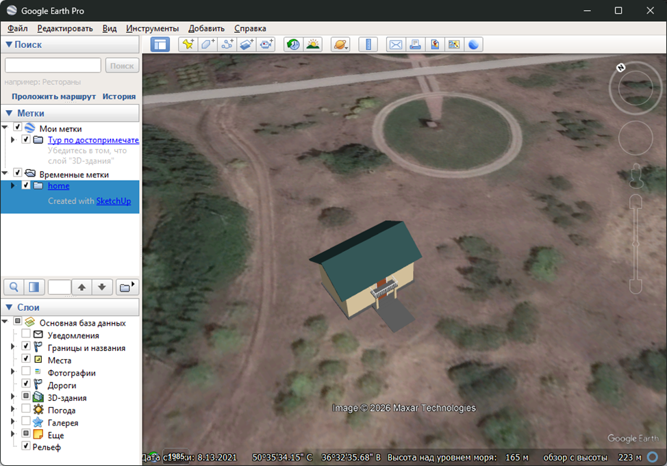<br><b>4. Интеграция в Google Earth</b></td>
  </tr>
</table>

<div align="right"><a href="#-навигация-по-работам">⬆ Наверх к меню</a></div>

---

<a id="-лабораторная-работа-3"></a>
## 🌐 Лабораторная работа 3
### Создание модели глобуса с географической сеткой

Разработка собственного 3D ГИС-движка на базе **RAD Studio C++ Builder**.

> [!IMPORTANT]
> Для исключения графического артефакта **Z-fighting** (мерцания текстур при наложении), сфера координатной сетки имеет радиус $R = 1.02 \cdot R_{earth}$.

#### Управление в сцене:
- <kbd>LMB</kbd> + `Mouse Move`: Свободное вращение глобуса (Drag & Drop).
- <kbd>UI TreeView</kbd>: Переключение текстурных слоев (Топография / Температура).

#### 📸 Галерея интерфейса:
<!-- Объединение трех картинок в компактную галерею -->
<table align="center">
  <tr>
    <td align="center" width="50%">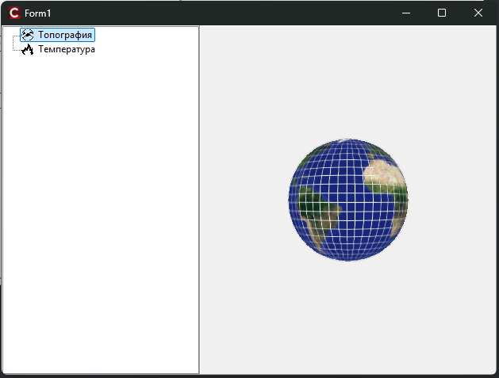<br><i>Слой: Топография</i></td>
    <td align="center" width="50%">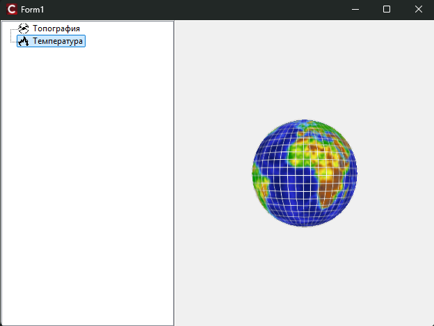<br><i>Слой: Температура</i></td>
  </tr>
  <tr>
    <td colspan="2" align="center"><br><i>Общий вид с наложенной сеткой координат</i></td>
  </tr>
</table>

<div align="right"><a href="#-навигация-по-работам">⬆ Наверх к меню</a></div>

---

<a id="-лабораторная-работа-4"></a>
## 📍 Лабораторная работа 4
### Работа с GPS и картами в Android

> [!CAUTION]
> Начиная с Android 13, недостаточно указать права в манифесте. Реализован динамический запрос разрешения `ACCESS_FINE_LOCATION` в Runtime.

#### Особенности реализации:
- **Картография:** Динамическая подгрузка `OpenStreetMap` через `TWebBrowser` для обхода ограничений intent-ов Google Maps.
- **Потоки:** Обратное геокодирование (`TGeocoder`) вынесено в фоновый поток через `TThread.Queue`, чтобы интерфейс приложения не зависал при слабом интернете.

<details>
<summary><b>📦 Посмотреть исходный код обработчика (Delphi FMX)</b></summary>

```pascal
procedure TForm1.LocationSensor1LocationChanged(Sender: TObject; const OldLocation, NewLocation: TLocationCoord2D);
begin
  // Форматируем координаты с точкой
  FS := TFormatSettings.Create('en-US');
  Lats := FloatToStr(NewLocation.Latitude, FS);
  Longs := FloatToStr(NewLocation.Longitude, FS);
  
  // Обновляем карту в браузере
  URL := Format('https://www.openstreetmap.org/?mlat=%s&mlon=%s', [Lats, Longs]);
  WebBrowser1.Navigate(URL);
end;
```
</details>

#### Тестирование на мобильном устройстве:
<table align="center" width="100%">
  <tr>
    <th width="35%">📱 Клиент на смартфоне</th>
    <th width="65%">🗺 Обратное геокодирование (OSM)</th>
  </tr>
  <tr>
    <td align="center">
      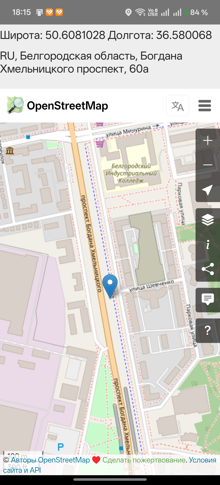
    </td>
    <td align="center">
      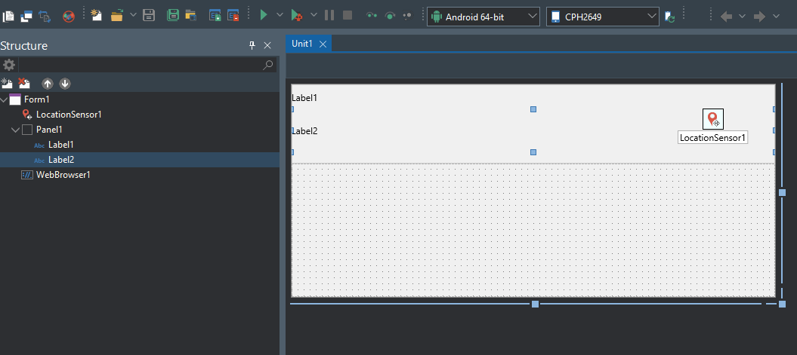
    </td>
  </tr>
</table>

<div align="right"><a href="#-навигация-по-работам">⬆ Наверх к меню</a></div>

---

<a id="-лабораторная-работа-5"></a>
## 🇷🇺 Лабораторная работа 5
### Локализация (i18n) приложения

Реализована полная локализация интерфейса (перевод на Русский язык) с использованием встроенного менеджера ресурсов RAD Studio.

> [!NOTE]
> Были переведены не только статические надписи на кнопках (`Labels`), но и заголовки форм, а также всплывающие системные уведомления.

<p align="center">
  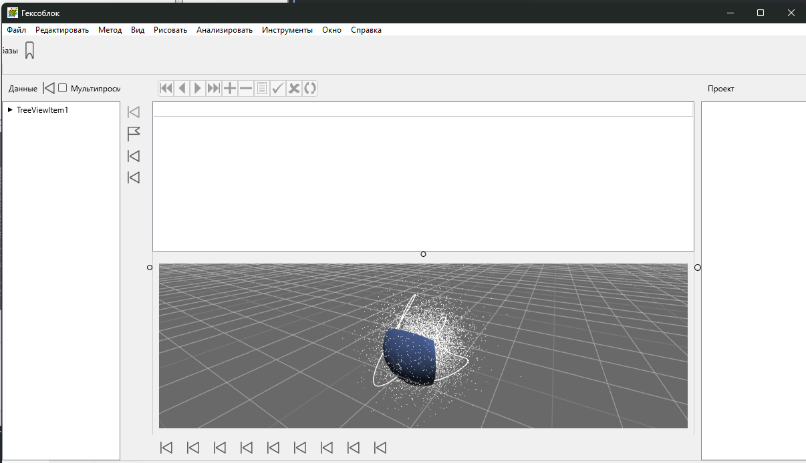<br><i>Главное окно приложения</i>
</p>

<details>
<summary><b>🔍 Посмотреть остальные переведенные формы</b></summary>

<p align="center">
  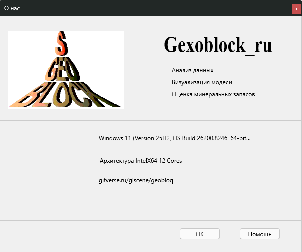
  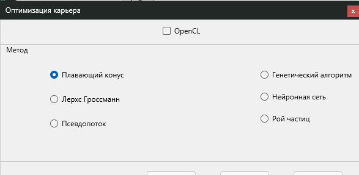
</p>
</details>

<div align="right"><a href="#-навигация-по-работам">⬆ Наверх к меню</a></div>

---

## 🎓 Итоги курса
В ходе выполнения цикла лабораторных работ были успешно освоены:
-[x] Анализ и генерация математических моделей рельефа (Surfer).
- [x] 3D-моделирование и работа с картографическими проекциями (KMZ).
- [x] Низкоуровневая разработка 3D-графики и сцен на C++.
- [x] Кроссплатформенная мобильная разработка под Android, работа с GPS-сенсорами.

<div align="center">
  
</div>
